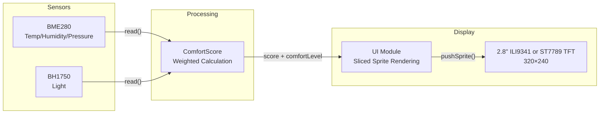
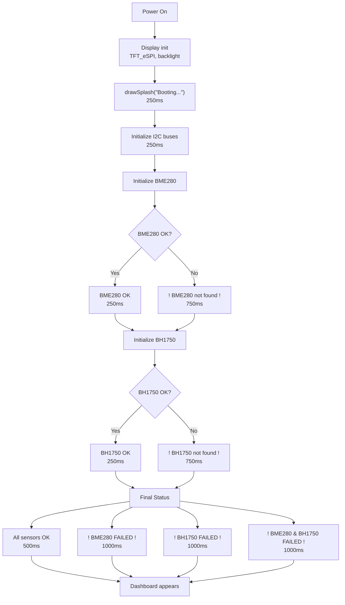

# Smart Classroom Monitor

*This project was developed with AI-assisted code generation and human oversight.*

ESP32-based classroom environmental monitoring system with 2.8" ILI9341 TFT display. Real-time temperature, humidity, pressure, and light readings with a comfort score (0–100%). Designed for PBL (Project-Based Learning).

**Yes, this is for a School project. Specifically for the PBL class.**

## Features

- **Real-time monitoring** — Temperature, humidity, pressure, light
- **Comfort Score** — Weighted calculation (Temp: 40%, Humidity: 40%, Light: 20%)
- **Flicker-free UI** — Sliced sprite rendering with 160px vertical buffers
- **Graceful degradation** — Fallback values if sensors fail
- **Boot sequence** — Visual feedback for each initialization step
- **Dynamic border** — Color changes with comfort level

## Prerequisites

Before building and flashing, ensure you have:

- [PlatformIO IDE](https://platformio.org/install) (VS Code extension or CLI)
- ESP32 USB drivers ([CP210x](https://www.silabs.com/developers/usb-to-uart-bridge-vcp-drivers) or [CH340](https://www.wch.cn/download/CH341SER_EXE.html) depending on your board)
- USB cable (data-capable, not just charging)

The project uses PlatformIO's dependency management — all required libraries will be automatically downloaded during the first build.

## Hardware

- **MCU**: ESP32-WROOM-32 (30-pin devboard)
- **Display**: 2.8" ILI9341 or ST7789 TFT (VSPI, 320×240)
- **Sensors**: BME280 (temp/humidity/pressure), BH1750 (light)
- **Power**: USB-C (5V)

### Pin Configuration

| Component | Pins |
|-----------|------|
| **TFT** | CS: 15, DC: 2, RST: 4, LED: 5, MOSI: 23, MISO: 19, SCLK: 18 |
| **BME280** | SDA: 21, SCL: 22 |
| **BH1750** | SDA: 16, SCL: 17 |

## Quick Start

### 1. Install Dependencies

```bash
pio lib install
```

### 2. Build & Upload

```
pio run -t upload
```

### 3. Power On

The device boots automatically. Splash screen shows sensor initialization status.

## Architecture



## Configuration

All settings are split across two config files:

**`include/config/Config.h`** — Comfort score logic, thresholds, weights, fallback values
**`include/config/HardwareConfig.h`** — Pin definitions, display settings, sensor addresses

### Timing

| Setting | Value | Description |
|---------|-------|-------------|
| `SENSOR_READ_INTERVAL` | 1000ms | Sensor polling interval |

### Comfort Score Weights

| Setting | Value | Description |
|---------|-------|-------------|
| `WEIGHT_TEMP` | 0.40f | Temperature weight |
| `WEIGHT_HUMID` | 0.40f | Humidity weight |
| `WEIGHT_LIGHT` | 0.20f | Light weight |

### Comfort Score Thresholds

| Setting | Value | Description |
|---------|-------|-------------|
| `TEMP_IDEAL_LOW` | 23.0°C | Temperature ideal low |
| `TEMP_IDEAL_HIGH` | 27.0°C | Temperature ideal high |
| `TEMP_MAX_DIFF` | 10.0°C | Temperature max deviation |
| `HUMID_IDEAL_LOW` | 40.0% | Humidity ideal low |
| `HUMID_IDEAL_HIGH` | 60.0% | Humidity ideal high |
| `HUMID_MAX_DIFF` | 40.0% | Humidity max deviation |
| `LIGHT_IDEAL_LOW` | 300.0 lux | Light ideal low |
| `LIGHT_IDEAL_HIGH` | 500.0 lux | Light ideal high |
| `LIGHT_MAX_DIFF` | 400.0 lux | Light max deviation |

### Comfort Score Levels

| Setting | Value | Description |
|---------|-------|-------------|
| `LEVEL_EXCELLENT` | 90.0% | Excellent threshold |
| `LEVEL_COMFORTABLE` | 75.0% | Comfortable threshold |
| `LEVEL_FAIR` | 60.0% | Fair threshold |
| `LEVEL_POOR` | 40.0% | Poor threshold |

### Fallback Values

| Setting | Value | Description |
|---------|-------|-------------|
| `FALLBACK_TEMP` | 25.0°C | Fallback temperature |
| `FALLBACK_HUMID` | 50.0% | Fallback humidity |
| `FALLBACK_PRESS` | 1013.25 hPa | Fallback pressure |
| `FALLBACK_LUX` | 400.0 lux | Fallback light |

### Display Settings

| Setting | Value | Description |
|---------|-------|-------------|
| `BACKLIGHT_BRIGHTNESS` | 128 (0–255) | Backlight PWM level |

### UI Colors

| Setting | Value | Description |
|---------|-------|-------------|
| `COLOR_INFO` | 0x9D13 | Info text color |
| `COLOR_OK` | TFT_GREEN | Success status |
| `COLOR_ERROR` | TFT_RED | Error status |

### Comfort Score Colors

| Score Range | Status | Color |
|-------------|--------|-------|
| ≥90% | Excellent | TFT_GREEN |
| 75–89% | Comfortable | TFT_GREEN |
| 60–74% | Fair | TFT_YELLOW |
| 40–59% | Poor | 0xFB00 (Orange) |
| <40% | Uncomfortable | TFT_RED |

### Fonts (GFX FreeFonts)

| Element | Font |
|---------|------|
| Header | FreeSansBold12pt7b |
| Comfort label | FreeSans12pt7b |
| Comfort value | FreeSansBold24pt7b |
| Card label | FreeSans9pt7b |
| Card value | FreeSansBold12pt7b |

## Boot Sequence



**Boot Times:**

- All OK: ~2.0s
- One fails: ~3.0s
- Both fail: ~4.0s

> **Note:** Status messages are intentionally delayed for readability during boot.

## Project Structure

```
Smart-Classroom-Monitor/
├── include/
│   └── config/
│       ├── Config.h            # Comfort score logic constants
│       └── HardwareConfig.h    # Pin definitions, display settings
├── src/
│   ├── sensors/
│   │   ├── BME280.cpp
│   │   └── BH1750.cpp
│   ├── comfort_score.cpp
│   ├── display/
│   │   ├── display_manager.cpp
│   │   └── ui.cpp
│   └── main.cpp
├── docs/
│   └── Code_Layout_Standard.md
├── platformio.ini
└── README.md
```

## Troubleshooting

| Symptom | Likely Fix |
|---------|------------|
| Screen stays white | Check TFT wiring; verify `User_Setup.h` pin match |
| Sensors show fallback values | Check I2C wiring; verify power to sensors |
| Boot loop | Check sensor addresses in `HardwareConfig.h` |
| Display flickers | Adjust `BUF_HEIGHT` in `ui.h` |
| Comfort score stuck at 0% | Check sensor readings; verify weights in `Config.h` |
| Backlight dim/off | Adjust `BACKLIGHT_BRIGHTNESS` in `HardwareConfig.h` |
| Wrong colors | Check `TFT_RGB_ORDER` in `User_Setup.h` (TFT_RGB or TFT_BGR) |

## For Developers

This project enforces a strict code layout standard documented in [`docs/Code_Layout_Standard.md`](docs/Code_Layout_Standard.md). Key rules:

- One logical module per file
- Headers declare public API only — no implementation
- Source files contain all implementation and internal state
- Comment hierarchy: T1 (file header) → T7 (inline notes)

When contributing, follow the visual hierarchy scale defined in the standard document.

## License

MIT