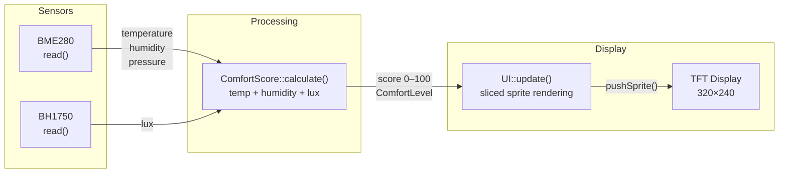
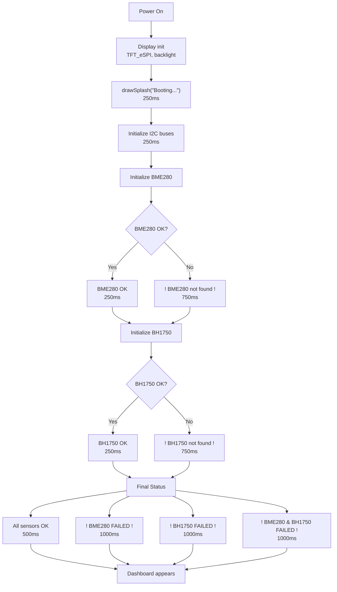

# Smart Classroom Monitor Architecture

## Overview

ESP32-WROOM-32-based classroom environmental monitoring system that collects real-time sensor data (temperature, humidity, pressure, light) and converts it into a simplified comfort score (0–100). The system is designed for real-time visualization on a 2.8" ILI9341 TFT display.

- **MCU:** ESP32-WROOM-32 (30-pin devboard)
- **Display:** 2.8" ILI9341 or ST7789 TFT (HSPI, 320×240)
- **Sensors:** BME280 (temp/humidity/pressure), BH1750 (light)
- **UI:** TFT_eSPI with GFX FreeFonts, sliced sprite rendering
- **Comfort Score:** Weighted calculation (Temp: 40%, Humidity: 40%, Light: 20%)

---

## Hardware Architecture

### Pinout

**Right Side (Display — HSPI)**

| Pin | Function |
|-----|----------|
| GPIO 15 | TFT_CS |
| GPIO 2  | TFT_DC |
| GPIO 4  | TFT_RST |
| GPIO 5  | TFT_LED (backlight PWM) |
| GPIO 18 | TFT_SCLK |
| GPIO 19 | TFT_MISO |
| GPIO 23 | TFT_MOSI |

**Right Side (Sensors — I2C)**

| Pin | Function |
|-----|----------|
| GPIO 16 | BH1750 SDA |
| GPIO 17 | BH1750 SCL |

**Left Side (Sensors — I2C)**

| Pin | Function |
|-----|----------|
| GPIO 26 | BME280 SDA |
| GPIO 27 | BME280 SCL |

### Display Configuration

- **Driver:** ILI9341
- **SPI:** VSPI (`USE_HSPI_PORT` disabled)
- **Rotation:** 1 (landscape, 320×240)
- **Backlight:** PWM on GPIO 5, default 160/255

### Sensor Configuration

**BME280**
- I2C address: 0x76
- Separate I2C bus (TwoWire instance 1)
- Polling interval: 1 second
- Fallback values: 25.0°C, 50.0%, 1013.25 hPa

**BH1750**
- I2C address: 0x23
- Separate I2C bus (TwoWire instance 0)
- Mode: Continuous High Resolution
- Fallback value: 400.0 lux

---

## Firmware Architecture

### Module Organization

**Sensors** (`src/sensors/`)
- `BME280` — Temperature, humidity, pressure sensor driver
- `BH1750` — Ambient light sensor driver
- Responsible for:
  - Hardware initialization
  - Raw sensor polling
  - Basic validity checks
- No processing or interpretation logic

**ComfortScore** (`src/comfort_score.cpp`)
- Stateless computation module
- Converts raw sensor data into a single comfort score (0–100)
- Uses threshold-based normalization per sensor:
  - Temperature: 23–27°C ideal band
  - Humidity: 40–60% ideal band
  - Light: 300–500 lux ideal band
- Weighted scoring model:
  - Temperature: 0.40
  - Humidity: 0.40
  - Light: 0.20
- Deterministic output, no internal state
- No hardware access
- Returns `ComfortLevel` struct with status, label, and color

**Display** (`src/display/`)
- `DisplayManager` — TFT_eSPI hardware abstraction (init, backlight, rotation)
- `UI` — TFT rendering logic with sliced sprite engine
  - Sliced rendering: 160px vertical slices for flicker-free updates
  - Dynamic border: Changes color based on comfort level
  - Metrics cards: Temperature (orange), Humidity (blue), Pressure (sky blue), Light (gold)
  - Two screens: Splash (boot sequence) and Dashboard (live data)
- Fonts: GFX FreeFonts only (all built-in fonts disabled to save flash)
  - Header: FreeSansBold12pt7b
  - Comfort label: FreeSans12pt7b
  - Comfort value: FreeSansBold24pt7b
  - Card label: FreeSans9pt7b
  - Card value: FreeSansBold12pt7b

### Sliced Rendering

The UI uses a sliced sprite rendering technique to eliminate flicker:

1. **Sprite buffer**: 160px × 320px (half the screen height) → 102KB RAM
2. **Render loop**: Two passes — top half (0–159) and bottom half (160–239)
3. **Intersection culling**: `_isIntersecting()` skips drawing elements outside the current slice
4. **Push to TFT**: Each slice is rendered to the sprite then pushed in one operation

**Benefits:**
- No flicker (full frame rendered off-screen before display)
- Memory efficient (102KB vs 153KB for full frame)
- Clean push to TFT with `pushSprite()`

**Why 160px?** Half of 320px height — balances memory usage against rendering performance.

**System Core**

**Main Controller** (`src/main.cpp`)
- System initialization with boot sequence
- Periodic update loop (1-second interval)
- Data flow orchestration between modules
- Sensor fallback handling (graceful degradation)
- No computation or UI logic
- `vTaskDelay(1)` for RTOS-aware yielding in loop

---

## Data Flow



---

## Boot Sequence



### Boot Timing

| Case | Total Time |
|------|------------|
| All OK | ~2.0s |
| One fails | ~3.0s |
| Both fail | ~4.0s |

---

## Update Cycle

1. **Every 1 second** (`SENSOR_READ_INTERVAL`):

- `read_bme280()` — Poll BME280, update last valid values
- `read_bh1750()` — Poll BH1750, update last valid lux
- `ComfortScore::calculate()` — Compute weighted score
- `ui.update()` — Render new frame to TFT

2. **Render flow**:

- `_renderFrame()` — Slice screen into 160px vertical chunks
- `_drawScene()` — Draw border, header, comfort score, metrics cards
- `_drawCard()` — Render individual metric cards with dynamic colors
- `_sliceSpr.pushSprite()` — Push each slice to TFT

3. **Loop yield**: `vTaskDelay(1)` — RTOS-aware yield, 10ms tick

---

## Graceful Degradation (Fallback)

**Sensor failure handling:**

| Scenario | Behavior |
|----------|----------|
| Sensor never initializes | Uses hardcoded defaults (25°C, 50%, 1013 hPa, 400 lux) |
| Sensor fails mid-run | Keeps last valid reading |
| Both sensors fail | Display still shows fallback values |
| Display shows plausible data | User sees non-blank screen |

**Implementation:**

```cpp
if (!bme280Available) {
    temp = lastValidTemp;      // Use last known good value
    humidity = lastValidHumidity;
    pressure = lastValidPressure;
    return false;
}
```

---

## Design Principles

### Separation of Concerns

- Sensors → raw data acquisition only
- ComfortScore → interpretation layer only
- Display → presentation only (sliced rendering)
- Main → orchestration only

### Non-Blocking Architecture

- No `delay()` in loop (except boot splash for readability)
- All timing based on `millis()` and `vTaskDelay()`
- Sensor reads non-blocking
- UI updates non-blocking

### Hardware Ownership

- `DisplayManager` owns TFT_eSPI
- `BME280` namespace owns sensor instance
- `BH1750Sensor` namespace owns sensor instance
- No shared hardware ownership

### Fallback Values

- Hardcoded defaults at boot
- Last valid readings preserved in RAM
- Display never goes blank
- User always sees something plausible

---

## Configuration Files

### `include/config/Config.h`

Comfort score logic constants:
- Comfort score weights (`WEIGHT_TEMP`, `WEIGHT_HUMID`, `WEIGHT_LIGHT`)
- Ideal ranges and max deviations for temperature, humidity, light
- Comfort score level thresholds (`LEVEL_EXCELLENT`, `LEVEL_COMFORTABLE`, `LEVEL_FAIR`, `LEVEL_POOR`)
- Sensor fallback values (`FALLBACK_TEMP`, `FALLBACK_HUMID`, `FALLBACK_PRESS`, `FALLBACK_LUX`)
- Display settings (`BACKLIGHT_BRIGHTNESS`)
- UI colors (`COLOR_INFO`, `COLOR_OK`, `COLOR_ERROR`)

### `include/config/HardwareConfig.h`

Hardware pin definitions:
- TFT pins (CS, DC, RST, LED, MOSI, MISO, SCLK)
- BME280 pins (SDA, SCL) and I2C address
- BH1750 pins (SDA, SCL) and I2C address
- Screen dimensions (320×240)

### `User_Setup.h` (TFT_eSPI)

- Display driver: ILI9341_DRIVER
- VSPI pins (MISO 19, MOSI 23, SCLK 18, CS 15, DC 2, RST 4, LED 5)
- VSPI port enabled (`USE_HSPI_PORT` disabled)
- GFX FreeFonts only (all built-in fonts disabled)
- SPI frequency: 40 MHz

---

## Dependencies

**PlatformIO Libraries:**

- `adafruit/Adafruit BME280 Library@^2.3.0`
- `claws/BH1750@^1.3.0`
- `bodmer/TFT_eSPI@^2.5.43`
- `adafruit/Adafruit Unified Sensor@^1.1.14`

**Built-in:**

- Arduino framework (ESP32)
- Wire (I2C)
- SPI
- math.h
- stdio.h

---

## Performance

| Metric | Value |
|---|---|
| Sensor read interval | 1000ms (1 second) |
| Display update | Every sensor read |
| Sliced render buffer | 160px × 320px |
| Frame rate | ~1 FPS (sensor-bound) |
| Boot time (all OK) | ~2.0s |
| Boot time (one fail) | ~3.25s |
| Boot time (both fail) | ~4.0s |

---

## Current Status

- Hardware wiring complete and tested
- Sensors initialized and reading
- UI rendering with sliced sprites
- Boot sequence functional
- Fallback values working
- Ready for deployment in classroom

---

## Known Limitations

- No WiFi/Bluetooth — standalone only
- No data logging — display-only
- No touch support — not needed
- Sensor failure detection at boot only (no runtime re-init)
- `delay()` used in boot sequence (intentional for splash readability)
- `vTaskDelay(1)` used in loop for RTOS yield