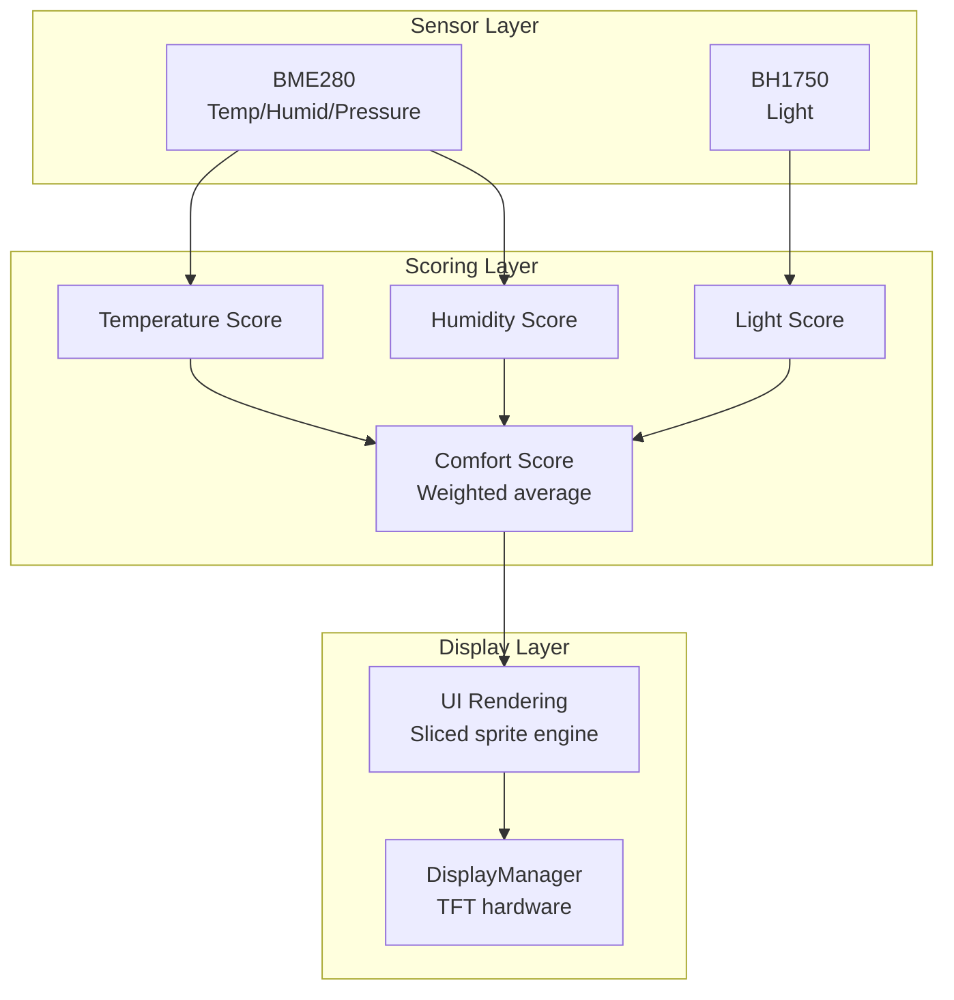
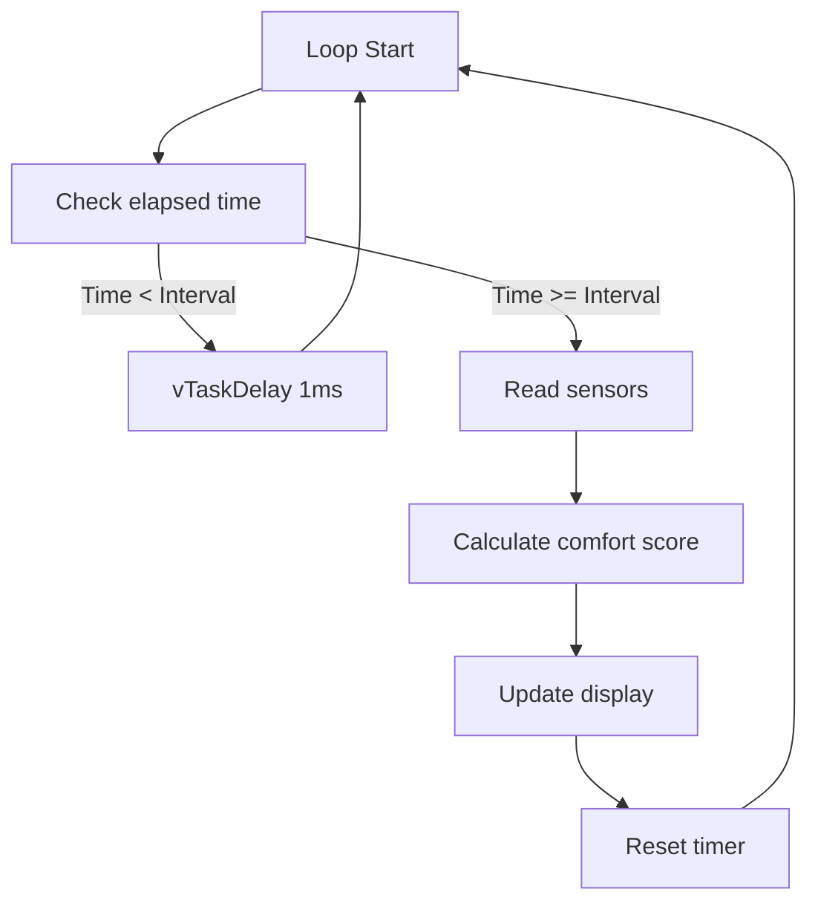
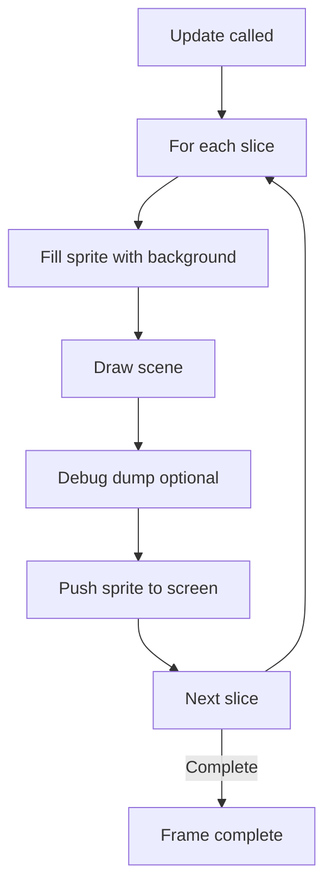
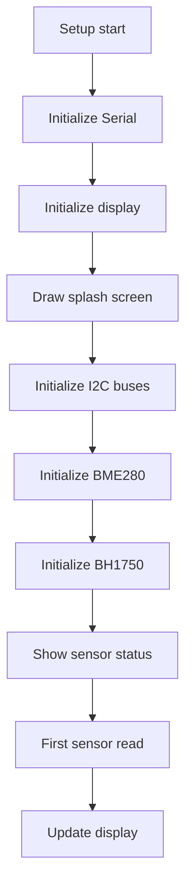
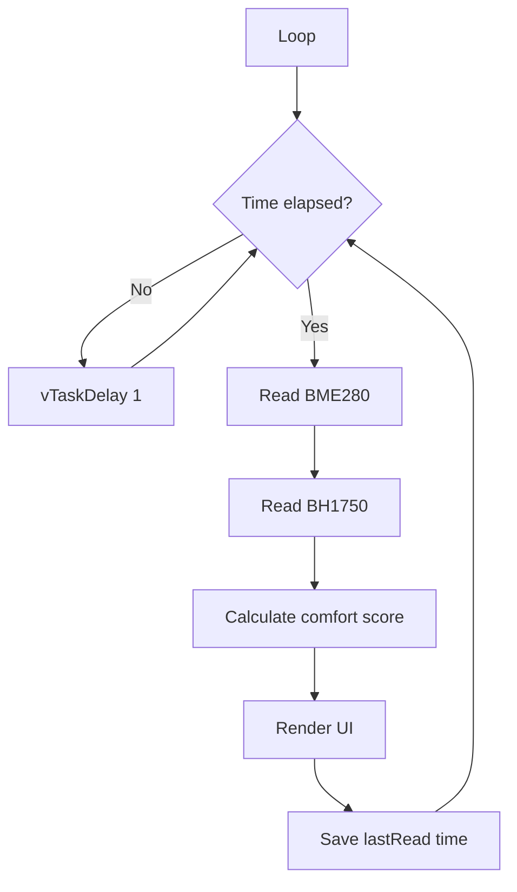

# Smart Classroom Comfort Monitor Architecture

## Overview

Firmware for an ESP32-based environmental monitoring system. Measures temperature, humidity, pressure, and light, calculates a comfort score, and displays results on a TFT screen. Modular C++ architecture on the Arduino Framework.

This is a student project developed for a PBL (Project-Based Learning) course at school.

## Why This Project Exists

This project monitors indoor environmental conditions in a classroom setting. It gives real-time feedback on comfort levels, helping occupants understand and adjust their environment.

### The Problem

Classrooms often have suboptimal conditions for learning:

- Temperature extremes (too hot or too cold)
- Inadequate humidity (too dry or too humid)
- Poor lighting (too dim or too bright)

### The Solution

An ESP32-based system that:

- Measures four key environmental parameters
- Calculates a weighted comfort score
- Displays results on a TFT screen
- Updates every second

## Firmware Architecture

### Module Organization

**Core** (`src/`)

- `main.cpp` — System initialization and main loop
- `comfort_score.cpp` — Comfort score calculation algorithm

**Display** (`src/display/`)

- `DisplayManager` — Hardware abstraction for TFT display
- `UI` — UI rendering with sliced sprite rendering

**Sensors** (`src/sensors/`)

- `BME280` — Temperature, humidity, pressure sensor wrapper
- `BH1750Sensor` — Ambient light sensor wrapper

**Configuration** (`include/config/`)

- `Config.h` — Software behavior settings
- `HardwareConfig.h` — Hardware pin assignments
- `DebugConfig.h` — Debug output toggles

### Data Flow



### Main Loop Flow




## Comfort Score Calculation

### Individual Metric Scores

Each metric is scored from 0 to 100 based on distance from the ideal range.

**Temperature Parameters**

- Ideal: 23°C to 27°C
- Max difference: 10°C
- Score drops linearly outside the ideal range

**Humidity Parameters**

- Ideal: 40% to 60%
- Max difference: 40%
- Score drops linearly outside the ideal range

**Light Parameters**

- Ideal: 300 lx to 500 lx
- Max difference: 400 lx
- Score drops linearly outside the ideal range

### Overall Comfort Score

```
comfort_score = (temp_score * 0.40) + (humid_score * 0.40) + (light_score * 0.20)
```

Weighted values are clamped to 0-100.

### Comfort Levels

| Score Range | Status | Color |
|---|---|---|
| 90-100 | Excellent | TFT_GREEN |
| 75-89 | Comfortable | TFT_GREEN |
| 60-74 | Fair | TFT_YELLOW |
| 40-59 | Poor | 0xFB00 (orange) |
| 0-39 | Uncomfortable | TFT_RED |

## UI Rendering Engine

### Sliced Sprite Rendering

The UI uses a sliced rendering technique to reduce memory usage and improve performance.

**How it works**

1. The screen (320x240) is divided into horizontal slices
2. Each slice has a height of `BUF_HEIGHT` (120 pixels)
3. A sprite of size `SCREEN_WIDTH x BUF_HEIGHT` is created
4. Each slice is rendered independently into the sprite
5. The sprite is pushed to the screen

**Benefits**

- Lower memory usage (only half the screen buffer needed)
- Faster rendering (less data to push per frame)
- Clean separation of drawing logic

### Rendering Pipeline



### UI Layout

The screen layout consists of:

1. **Border**: 5-pixel colored border around the screen
2. **Header**: "Smart Classroom Monitor" at the top
3. **Comfort Score**: Large score display in the center
4. **Metrics**: Four metric cards at the bottom

### Metric Cards

Each metric card shows:

- Label (e.g., "[Temperature]")
- Value with unit
- Border color based on metric score

| Metric | Unit | Color |
|---|---|---|
| Temperature | C | 0xFB00 (orange) |
| Humidity | % | 0x051F (cyan) |
| Pressure | hPa | TFT_SKYBLUE |
| Light | lx | TFT_GOLD |

## Sensor Subsystem

### BME280

**Initialization**

- I2C address: 0x76 (default)
- Uses the Adafruit_BME280 library
- Supports custom TwoWire instance

**Reading**

- Returns temperature (C), humidity (%), and pressure (hPa)
- All three values read in a single operation
- Valid flag indicates success

### BH1750

**Initialization**

- I2C address: 0x23 (default)
- Uses the BH1750 library by Christopher Laws
- Mode: CONTINUOUS_HIGH_RES_MODE
- Supports custom TwoWire instance

**Reading**

- Measurement ready check before reading
- Returns light level in lux
- Valid flag indicates success

### I2C Bus Configuration

Two independent I2C buses are used to prevent sensor conflicts:

| Bus | Pins | Sensors |
|---|---|---|
| Bus 0 (I2C) | SDA 21, SCL 22 | BME280 |
| Bus 1 (I2C) | SDA 16, SCL 17 | BH1750 |

### Fallback Values

If a sensor is unavailable, the system uses fallback values:

| Metric | Fallback |
|---|---|
| Temperature | 25.0°C |
| Humidity | 50.0% |
| Pressure | 1013.25 hPa |
| Light | 400.0 lx |

The last valid reading is cached and used if a sensor read fails. This gives smooth operation even during temporary sensor failures.

## Configuration System

### Config.h

Software behavior settings:

```
// Timing
constexpr unsigned long SENSOR_READ_INTERVAL = 1000;

// Weights
constexpr float WEIGHT_TEMP  = 0.40f;
constexpr float WEIGHT_HUMID = 0.40f;
constexpr float WEIGHT_LIGHT = 0.20f;

// Thresholds
constexpr float TEMP_IDEAL_LOW    = 23.0f;
constexpr float TEMP_IDEAL_HIGH   = 27.0f;
constexpr float HUMID_IDEAL_LOW   = 40.0f;
constexpr float HUMID_IDEAL_HIGH  = 60.0f;
constexpr float LIGHT_IDEAL_LOW   = 300.0f;
constexpr float LIGHT_IDEAL_HIGH  = 500.0f;

// Comfort levels
constexpr float LEVEL_EXCELLENT   = 90.0f;
constexpr float LEVEL_COMFORTABLE = 75.0f;
constexpr float LEVEL_FAIR        = 60.0f;
constexpr float LEVEL_POOR        = 40.0f;
```

### HardwareConfig.h

Hardware pin assignments and addresses:

```
// I2C
#define BME280_SCL  22
#define BME280_SDA  21
#define BH1750_SCL  17
#define BH1750_SDA  16

// Addresses
#define BME280_ADDR  0x76
#define BH1750_ADDR  0x23

// Display (reference only - set in User_Setup.h)
#define TFT_MISO 19
#define TFT_MOSI 23
#define TFT_SCLK 18
#define TFT_CS   15
#define TFT_DC    2
#define TFT_RST   4
#define TFT_BL    5
```

### DebugConfig.h

Debug output toggles:

```
#define DEBUG_ENABLED  1

#if DEBUG_ENABLED
    #define DEBUG_FRAMEBUFFER_DUMP  0
    #define DEBUG_DUMP_EVERY_N      1
#endif
```

When framebuffer dumping is enabled, each rendered frame is sent to serial in raw RGB565 format with a simple protocol.

## Main Loop

### Setup Sequence



### Loop Sequence



### Non-blocking Operation

All timing is based on `millis()`. The loop never calls `delay()`, so the system remains responsive at all times.

## Debug Protocol (Framebuffer Dump)

When `DEBUG_FRAMEBUFFER_DUMP` is enabled, the system sends raw framebuffer data over Serial at 921600 baud.

**Packet Format**

| Field | Size | Description |
|---|---|---|
| Magic | 2 bytes | 0xA55A |
| X | 2 bytes | Slice X position |
| Y | 2 bytes | Slice Y position |
| Width | 2 bytes | Slice width |
| Height | 2 bytes | Slice height |
| Data Length | 4 bytes | Total bytes in payload |
| Payload | Variable | RGB565 pixel data |
| End | 2 bytes | 0x5AA5 |

**Frame End**

When all slices are transmitted, a frame end marker is sent:

| Field | Size | Description |
|---|---|---|
| Frame End | 2 bytes | 0x55AA |

This protocol is intended for development tools that can capture and decode the framebuffer data.

## Performance

| Metric | Value |
|---|---|
| Update interval | 1000 ms |
| Sensor read time | ~100 ms (both sensors) |
| Render time | ~50 ms (full frame) |
| Memory usage | ~40 KB (static) |
| Heap usage | ~10 KB (dynamic) |

## Current Status

- Core firmware complete and tested
- Display rendering stable with sliced sprite technique
- Both sensor drivers tested and validated
- Comfort score algorithm verified
- Ready for deployment or further customization

## Known Limitations

- TFT_eSPI must be configured for the specific display
- BH1750 has a measurement ready check that must be polled
- Framebuffer dump uses high baud rate (921600)
- Only two I2C sensors are supported (no expansion)

## Extensibility

The modular architecture supports easy extension:

**Adding a new sensor**

1. Create a sensor wrapper class in `include/sensors/`
2. Implement `begin()` and `read()` methods
3. Add to the main loop read sequence
4. Add new metric to the UI

**Adding a new metric**

1. Add configuration constants to `Config.h`
2. Add scoring function to `comfort_score.cpp`
3. Add UI element to `ui.cpp`
4. Adjust comfort score weights

**Changing the UI**

1. Modify layout constants in `ui.h`
2. Update drawing functions in `ui.cpp`
3. Test with sliced sprite rendering

